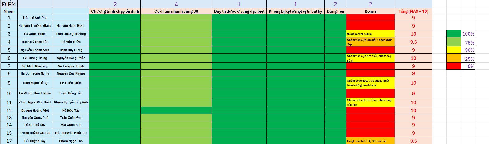

# Đề bài BTVN

Trong một trò chơi online nhiều người chơi, thế giới được biểu diễn trên mặt phẳng 2D với hệ trục tọa độ Oxy. Trò chơi bao gồm nhiều khu vực khác nhau, mỗi khu vực có diện tích rất lớn. Trong mỗi khu vực tồn tại nhiều dungeon, và trong mỗi dungeon sẽ có một con quái đặc biệt gọi là boss.

Mỗi đối tượng trong game (nhân vật, boss, dungeon, …) được xác định bởi tọa độ hai số thực `(x, y)`.

Bạn có một chương trình tự động điều khiển nhân vật, hoạt động theo quy trình:

1. **Quét xung quanh:** Nhân vật quét khu vực bán kính ≤ 50 quanh vị trí hiện tại.
2. **Xử lý kết quả quét:**

   * Nếu phát hiện có boss, nhân vật di chuyển (di chuyển khá nhanh, mất khoảng 1s nếu boss ở tối đa tầm) đến boss gần nhất và hạ gục nó; biến `lastBossID` được gán bằng ID của boss vừa bị hạ gục, sau đó quay lại bước 1.
   * Nếu không phát hiện boss, nhân vật giữ nguyên vị trí và `lastBossID = 0`.
3. **Xác định bước đi tiếp theo:**

   * Nếu nhân vật đang chưa đi tới bước tiếp theo thì tiếp tục đi tới; trong lúc đi có thể vừa đi vừa quét boss và nếu tìm thấy thì quay lại bước 1.
   * Nếu nhân vật đã đi tới thì gọi hàm `getNextPoint(x, y, lastBossID)` để lấy bước tiếp theo.

**Biết rằng:**

* Các dungeon được phân bố đều trong từng khu vực, cả ở trung tâm lẫn biên giới.
* Trung bình khoảng cách giữa các dungeon là 70 → 200; đôi khi vị trí có thể xa hơn do có dungeon đã bị người chơi khác hạ trước đó.
* Mỗi khu vực có mật độ dungeon và boss như nhau.
* **Đặc biệt:** Có một khu vực mà khoảng 63% số boss ở đó có `ID = 36` (thật ra là 50% 🐧), và boss có `ID = 36` chỉ xuất hiện duy nhất trong khu vực đó.

---

# Yêu cầu

Hãy xây dựng và mô tả thuật toán cho hàm `getNextPoint(x, y, lastBossID)` sao cho:

* Nhân vật có thể tìm ra và ở lại khai thác khu vực đặc biệt, dù bản đồ có diện tích rất lớn.
* Nhân vật hạ gục được nhiều boss nhất trong khu vực đặc biệt (không chỉ riêng boss `ID = 36`, mà mọi boss trong khu vực đó đều được tính).

---

# Lưu ý

* Khu vực đặc biệt đôi khi sẽ có dạng hình thù khá đặc biệt, có thể là một đa giác lõm.
* Liên hệ bạn Hà Thanh Phong (`24520024`) để được chỉnh sửa và chạy thử thực tế, xem cụ thể game.
* Các nhóm ưu tiên nộp trước **thứ 5 tuần sau** để bạn Phong có thể kịp tổng hợp các nhóm 🥳🥳😳

---

# 📊 Chấm điểm — Tổng hợp & Nhận xét

<!-- Hình bảng điểm -->

  
   
  <i>Hình 1 — Bảng điểm tổng hợp (nhấn vào để xem kích thước đầy đủ)</i>

## 📁 Bài nộp
> 🗂️ **Tất cả source code của các nhóm và file chạy `.exe` đều nằm trong thư mục `BTVN`.**
> 🪄 **Dùng file `.cmd` dưới quyền admin để chạy**

## ⭐️ Các tiêu chí chính (10 điểm)

| Tiêu chí | Mô tả ngắn | Điểm |
|---|---|---:|
| ✅ Ổn định chương trình | Chạy không crash, vào/ra hợp lệ | **2** |
| 🧭 Tìm nhanh vùng đặc biệt | Chiến lược di chuyển & phát hiện | **4** |
| 🎯 Duy trì trong vùng đặc biệt | Ổn định ở khu vực mục tiêu | **1** |
| 🧠 Không bị kẹt | Tránh lặp/vòng lẩn quẩn | **1** |
| ⏰ Đúng hẹn | Nộp đúng hạn | **2** |
| **Tổng** |  | **10** |

---

<b>✅ 1) Chương trình chạy ổn định (2 điểm)</b>

- Tiêu chí này “chill” cho anh em — **có chương trình chạy được** là có điểm.

<b>🧭 2) Tìm nhanh vùng đặc biệt (4 điểm)</b>

- Bối cảnh: **các vùng đất bị ngăn bởi biên giới**, vùng đặc biệt **có thể xuất hiện nhiều lần**.
- Ba cách tiếp cận phổ biến:
  1. 🔀 **Đi ngẫu nhiên** các hướng → *khá tệ* (dễ quay lại chỗ cũ).
  2. 🌀 **Đi theo hình xoắn ốc** → *ổn* nhưng **kém** cách 3.
  3. ➡️ **Chọn ngẫu nhiên một hướng rồi đi thẳng** → *hiệu quả hơn* trong đa số tình huống.

<b>🎯 3) Duy trì được ở vùng đặc biệt (1 điểm)</b>

- Các chiến lược hay dùng:
  - 🌀 **Xoay quanh một “tâm”**:
    - Tâm = **vị trí con 36 gần nhất**.
    - Hoặc tâm = **trung bình vị trí các con 36**.
- 🌟 **Nhóm 9 (Hùng & Quân)**: Dùng **thuật toán hướng tâm** (tâm = trung bình các con 36), di chuyển **ngẫu nhiên nhưng thiên về tâm** → giúp bám vùng tốt.
- ✅ **Chỉ cần có thuật toán xác định tâm** là đạt trọn điểm phần này.

<b>🧠 4) Không bị kẹt ở một vị trí bất kỳ (1 điểm)</b>

- Yêu cầu: **mỗi bước di chuyển phải đến điểm mới** ⇒ tránh lặp và “kẹt”.
- 💡 **Nhóm 3 (Thiện & Trường)** dùng **convex hull** để tránh bị “bao vây” bởi các dungeon đã dọn, **tối ưu lối thoát** khỏi vùng kẹt.

<b>⏰ 5) Đúng hẹn (2 điểm)</b>

- **Nộp đúng hẹn** là trọn điểm nha hihi (❁´◡`❁)

---

## 🧾 Tổng kết tiêu chí chính

- Đa phần các nhóm **chưa full điểm** ở phần **tìm khu vực đặc biệt**, **trừ nhóm Việt & Tây (nhóm 4)**.

---

## 🎁 Bonus (2 điểm)

- 🚀 **Nộp sớm + chủ động hỏi & đào sâu**:
  - **Nhóm 11** và **nhóm 5**: nộp **thứ 2**, có tìm hiểu **sâu** về đề.
- 🧪 **Thuật toán đặc biệt**:
  - **Nhóm 3 (Trường & Thiện)**
  - **Nhóm 9 (Quân & Hùng)**
  - **Nhóm 17 (Thọ & Huỳnh Tây)**:
    - Dùng **tỉ lệ số con 36 trong khu vực** để nhận diện “khu vực 36” → **ý tưởng mới mẻ**.
- 💪 **Nhóm tích cực làm bài**: **Nhóm 4 (Thức & Tân)**
  - Thức **tryhard** hết mình để săn **10 điểm** (dù chưa đạt (┬┬﹏┬┬)), **thức đến 2h sáng** → **xứng đáng bonus**.

---

> _“Đúng hướng sớm hơn tốt hơn tối ưu muộn.”_ — keep shipping 🚢

   

